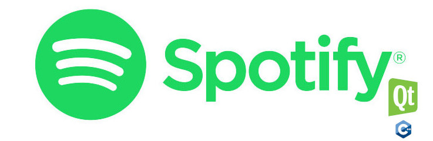

# SpotifyAppCpp
[Site do Projeto](https://euzebiod.github.io/SpotifyAppCpp//)

## Cliente Spotify feito em C++ com Qt.
```
Um cliente em C++ e Qt que acessa os serviços do Spotify.
```
Cliente usando a Web Api do Spotify, escrito em C++ e usando o framework qt.

Este cliente acessa os serviços do Spotify usando sua Web Api, que usa o padrão REST.

O sistema se loga no Spotify permitindo o usuário listar sua playlist, buscar músicas através de palavras chaves, adicionar ou excluir músicas de sua playlist, salvar e ler localmente uma playlist e tocar uma playlist.

## Ambiente de desenvolvimento
* Plataforma Windows 10.
* Qt 5.10
* Qt creator 4.5.1
* OpemSSl 1.0 ( a Versão 1.1x não funciona com o qt 5.10).
* MSVC2017 64bits (Webengine do Qt só funciona para este compilador).
* SDK Windows 10 (Debug no qt para o MSCV2017 64bits, Obs: não consegui usar o debug, o qt se atrapalhava com os sinais de comunicação do serviço REST - usar apenas no modo release).
